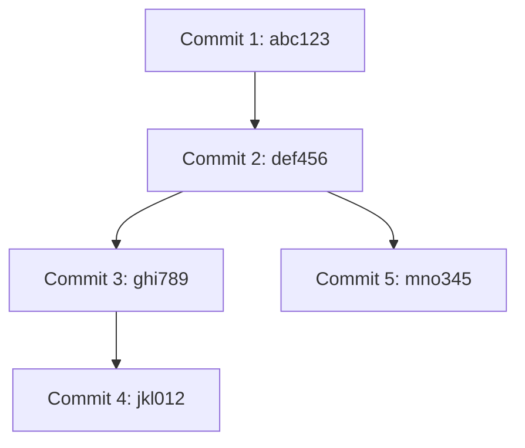

# Dependency Graph Visualizer

## Описание

**Dependency Graph Visualizer** — это инструмент командной строки, который создает граф зависимостей между коммитами в Git-репозитории. Он анализирует историю коммитов и визуализирует зависимости в формате **Mermaid** с последующим сохранением результата в PNG-файл.

Основные возможности:
- Построение графа зависимостей между коммитами (включая транзитивные зависимости).
- Учет коммитов только после указанной даты.
- Автоматическое создание PNG-изображения с графом.

## Требования

- Python 3.8 или выше
- Установленный Git (доступен через командную строку)
- Установленный Node.js (для Mermaid CLI)
- Mermaid CLI (`mmdc`) установлен через npm:
```bash
  npm install -g @mermaid-js/mermaid-cli
```
Установка
Убедитесь, что Python и Node.js установлены.
Установите Mermaid CLI:
```bash
npm install -g @mermaid-js/mermaid-cli
```
Скачайте или скопируйте репозиторий с этим проектом.
Конфигурация
Перед запуском создайте JSON-файл конфигурации, например, config.json. Пример содержимого:

```json
{
    "repo_path": "C:/Users/username/your-repo",
    "mermaid_cli_path": "C:/Users/username/AppData/Roaming/npm/mmdc",
    "output_path": "C:/Users/username/output/dependency_graph.png",
    "since_date": "2024-01-01"
}
```
Параметры:
repo_path: Путь к локальному Git-репозиторию.
mermaid_cli_path: Путь к исполняемому файлу Mermaid CLI (mmdc).
output_path: Путь и имя выходного PNG-файла.
since_date: Дата в формате YYYY-MM-DD, после которой будут анализироваться коммиты.
Как использовать
Сохраните скрипт в файл, например, dependency_graph.py.

Убедитесь, что config.json настроен правильно.

Запустите скрипт:

```bash
python dependency_graph.py config.json
```
Как это работает
Чтение конфигурации: Скрипт считывает параметры из файла config.json.

Анализ Git-репозитория: Извлекается список коммитов с их зависимостями (родителями) с помощью команды:

```bash
git log --since=<since_date> --pretty=format:"%H %P"
```
Создание Mermaid-графа: Формируется текстовый Mermaid-граф зависимостей в формате graph TD.

Генерация PNG: Mermaid CLI (mmdc) используется для рендеринга графа в PNG.

Вывод результата: PNG-файл сохраняется по указанному пути, и выводится сообщение об успешном выполнении.

Пример использования
Конфигурация
Пример config.json:

```json
{
    "repo_path": "C:/Users/username/MyRepo",
    "mermaid_cli_path": "C:/Users/username/AppData/Roaming/npm/mmdc",
    "output_path": "C:/Users/username/output/graph.png",
    "since_date": "2024-01-01"
}
```
Команда запуска
```bash
python dependency_graph.py config.json
```
Выходной результат
После выполнения вы найдете файл graph.png в папке, указанной в output_path.

Примечания
Если Mermaid CLI не установлен, выполните:
```bash
npm install -g @mermaid-js/mermaid-cli
```
Убедитесь, что в репозитории есть коммиты после указанной даты.
Если появляется ошибка [WinError 193], убедитесь, что путь к mmdc указан правильно в конфигурации.
Пример графа
Пример Mermaid-графа для визуализации:


После выполнения граф будет автоматически преобразован в PNG.